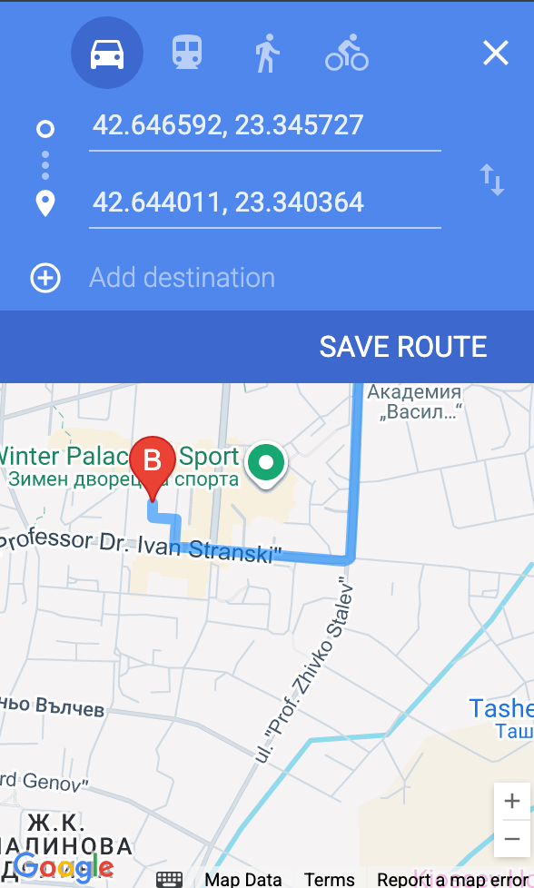
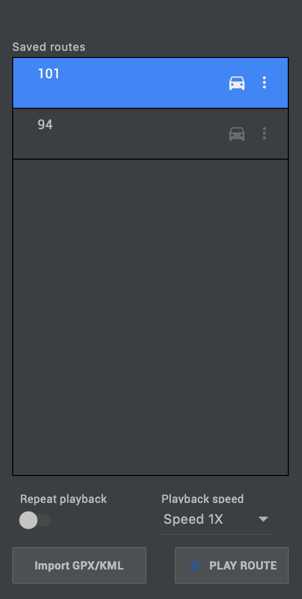

# Route Tracker App

## Demo
[Click here to view the demos](./documentation/videos/)

## Simulate routes using Android Studio's emulator
### Open Emulator Extended Controls

1. Start Android Emulator
2. Tap on 3 dots to open Emulator Extended Controls

### Define Route

1. Navigate to Location
2. Select Routes
3. You will see an input field with hint: "Search"
4. Type your second point coordinates or location name and press Enter
5. Tap on navigate Icon
6. Type your first point coordinates or location name and press Enter
7. Tap on Add Destination to Add one more waypoint to your route (You can add up-to 4 waypoints)
8. Then tap on Save route
9. Choose a meaningful name and safe
(You can also import GPX/KML) to import already defined routes

### Play a Route

1. Select create route
2. Tap on Play Route

## Simulate routes mobile Application
Demo recording was done on device using [Mock Locations App](https://play.google.com/store/apps/details?id=ru.gavrikov.mocklocations&hl=en)

